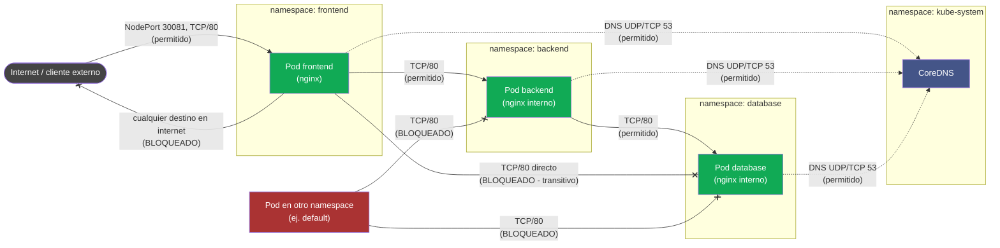

# Arquitectura

## Clúster base

- 3 nodos Kubernetes (kubeadm), CNI **Cilium** (+ Hubble), provisionados con Ansible (repo [`k8s-cilium-ansible`](https://github.com/Rixde/k8s-cilium-ansible.git)).
- `k8s.master01` actúa como control-plane **y** worker (sin taint), `k8s.worker01` y `k8s.worker02` son los otros dos workers.
- Entorno original de 3 nodos y parte del trabajo de Falco/Network Policies aportado por el equipo de Ricardo Uarte; fusionado con nuestra base de Ansible + Cilium (que reemplazó su instalación manual de Calico) y nuestras reglas/manifiestos declarativos.

## Runtime security: Falco

- DaemonSet de Falco (driver `modern_ebpf`) en los 3 nodos, con **21 reglas custom** (`helm/chart/values.yaml`) — fusión de las reglas propias y las del equipo de Ricardo Uarte, sin duplicados, documentadas en `docs/iso27001.md`.
- Falcosidekick reenvía alertas `WARNING` o más severas a Slack; todas las alertas (incluidas `NOTICE`) quedan en el dashboard de Falcosidekick UI (sin persistencia en Redis, por diseño — ver comentario en `helm/chart/values.yaml`).
- Todas las reglas excluyen los namespaces de infraestructura del propio clúster (`kube-system`, `kube-node-lease`, `kube-public`, `falco`) vía la lista `system_namespaces`, para no confundir operación normal del clúster con actividad sospechosa (criterio de triage, control A.5.25).

## Microsegmentación: Network Policies

Tres namespaces en cadena — **`frontend` → `backend` → `database`** —, con default-deny (ingress+egress) como base y whitelists explícitas encima. `frontend` nunca puede llegar a `database` directamente, aunque `backend` sí pueda alcanzar a ambos.

**Manifiestos de las políticas:** `manifests/network-policies/00-default-deny.yaml` (base, 3 namespaces), `01-allow-dns.yaml` (egress a CoreDNS, acotado por `podSelector: k8s-app=kube-dns` — no todo `kube-system`), `02-frontend-policies.yaml`, `03-backend-policies.yaml` (ingress desde frontend + egress hacia database), `04-database-policies.yaml` (solo ingress desde backend).

**Testing de conectividad:** `tests/smoke-tests.sh` valida automáticamente 2 flujos permitidos (`frontend→backend`, `backend→database`) y 4 bloqueados (`frontend→database` transitivo, `frontend→internet`, `default→backend`, `default→database`).

### Brecha residual declarada

Una `NetworkPolicy` **solo funciona si el CNI la implementa** — el manifiesto se acepta igual aunque el plugin de red lo ignore por completo, sin ningún error visible. En este clúster se usa **Cilium**, que sí implementa la API de `NetworkPolicy` (y además soporta `CiliumNetworkPolicy` para reglas L7). Las pruebas bloqueadas de `tests/smoke-tests.sh` son la evidencia de que la política realmente se está aplicando y no es un manifiesto "aceptado pero ignorado": si Cilium no la implementara, esas pruebas fallarían (el tráfico bloqueado pasaría igual).

Además, Falco **detecta pero no previene**: si un contenedor comprometido intenta las acciones que disparan nuestras reglas custom, la alerta llega después de que la acción ya ocurrió (lectura de archivo, shell abierta, etc.), no la impide.
